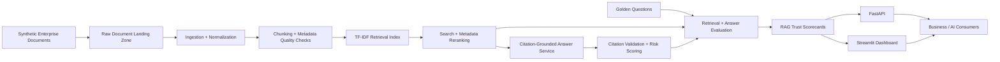

# Enterprise Document Intelligence + RAG Evaluation Lab


## Executive Summary

This project is a production-style AI Data Engineering and MLOps portfolio lab for evaluating whether enterprise RAG answers can be trusted. It converts synthetic policies, contracts, SOPs, audit files, and support documents into governed chunks, builds a deterministic retrieval index, generates citation-grounded answers, and produces measurable evidence for retrieval accuracy, citation quality, stale-document risk, sensitive-data risk, and hallucination risk.

It is intentionally not a generic "chat with PDF" demo. The focus is the enterprise evidence layer: golden questions, expected source documents, pass/fail retrieval checks, citation validation, answerability checks, risk reasons, scorecards, API responses, dashboard views, tests, CI, and Docker.

## Why Fortune 50 Companies Care

Large enterprises want GenAI assistants and AI agents over internal knowledge, but answers become risky when retrieval misses the right policy, citations are absent, stale procedures are used, or sensitive data appears in context. This lab demonstrates how teams can evaluate RAG quality before exposing answers to business users, workflows, or agents.

Core question:

> Can this answer be trusted, cited, evaluated, and safely used by a business user or AI agent?

## Architecture



## What Was Built

- Synthetic enterprise document corpus with controlled issues.
- 40-question golden evaluation set with expected document IDs and risk flags.
- Ingestion, normalization, metadata validation, and section-aware chunking.
- TF-IDF retrieval with deterministic metadata-aware reranking.
- Deterministic answer composer that cites retrieved chunks or abstains.
- Citation validation against retrieved chunks and expected supporting documents.
- Retrieval accuracy report with Hit@1, Hit@3, Hit@5, MRR, misses, and pass/fail by question.
- Answer quality report with answerability, citation coverage, groundedness, warnings, and hallucination-risk reasons.
- Chunk quality report for metadata completeness, stale chunks, sensitive chunks, and empty chunks.
- FastAPI service, Streamlit dashboard, pytest coverage, Ruff linting, Docker, and GitHub Actions.

## Key Evidence Outputs

- `data/raw_documents/injected_document_issue_manifest.json`
- `data/evaluations/golden_questions.json`
- `data/scorecards/chunk_quality_report.csv`
- `data/scorecards/chunk_quality_summary.json`
- `data/scorecards/retrieval_accuracy_report.csv`
- `data/scorecards/retrieval_accuracy_report.json`
- `data/scorecards/answer_quality_report.csv`
- `data/scorecards/answer_quality_report.json`
- `data/scorecards/rag_trust_scorecard.csv`
- `data/scorecards/rag_trust_summary.json`

Sample V0.2 evidence:

```json
{
  "total_questions": 40,
  "hit_at_3": 0.9706,
  "mrr": 0.9069,
  "answerability_accuracy": 97.5,
  "citation_coverage_average": 87.5,
  "overall_rag_trust_score": 78.5
}
```

## RAG Trust Score

The trust score combines retrieval quality, citation coverage, groundedness, hallucination risk, stale-document risk, sensitive-data risk, and answerability accuracy. It is not a claim that the system is production-ready; it is a deterministic evidence score showing how the local RAG baseline behaves against the golden test set.

Full formulas are documented in [docs/metrics.md](docs/metrics.md).

## Tech Stack

- Python 3.12
- pandas, numpy, scikit-learn
- DuckDB
- FastAPI, Uvicorn
- Streamlit
- pytest, Ruff
- Docker, GitHub Actions

## Fresh Clone Setup

Mac/Linux with Python 3.12:

```bash
git clone https://github.com/mohilamin/enterprise-rag-evaluation-lab.git
cd enterprise-rag-evaluation-lab

python3.12 -m venv .venv
source .venv/bin/activate

python -m pip install --upgrade pip
python -m pip install -r requirements.txt
```

Conda option:

```bash
conda create -n rag-eval-lab python=3.12 -y
conda activate rag-eval-lab
python -m pip install --upgrade pip
python -m pip install -r requirements.txt
```

If your default `python` points to Anaconda base or Python 3.8, activate a Python 3.12 virtual environment first and run commands with `python -m ...`.

## Run Commands

```bash
python -m src.data_generation.generate_documents
python -m src.data_generation.generate_golden_questions
python -m src.pipeline.run_all
python -m pytest
python -m ruff check .
```

Launch the API:

```bash
python -m uvicorn src.api.main:app --reload
```

Launch the dashboard:

```bash
python -m streamlit run src/dashboard/app.py
```

## API Examples

Search:

```bash
curl -X POST http://127.0.0.1:8000/search \
  -H "Content-Type: application/json" \
  -d '{"query": "What controls are required for privileged access?", "top_k": 3}'
```

Answer:

```bash
curl -X POST http://127.0.0.1:8000/answer \
  -H "Content-Type: application/json" \
  -d '{"question": "What controls are required for privileged access?", "top_k": 3}'
```

Key endpoints:

- `GET /health`
- `GET /documents`
- `GET /chunks`
- `POST /search`
- `POST /answer`
- `GET /evaluations`
- `GET /scorecards`
- `GET /rag-trust-summary`

## Dashboard

The Streamlit dashboard includes:

- Executive Overview
- Corpus Health
- Retrieval Metrics
- Answer Quality Metrics
- Hallucination Risk
- Stale, conflict, and sensitive-data warnings
- Golden question result explorer
- Search lab
- Example answer with citations

## Testing

V0.2 validation target: at least 35 tests.

Current local validation: `44 passed`, `ruff check .` passed.

## Known Limitations

- Synthetic documents only.
- TF-IDF baseline instead of embeddings.
- Deterministic answer composition instead of an LLM.
- Local DuckDB and files instead of an enterprise warehouse or vector database.
- Basic Streamlit UI rather than production product design.
- No authentication, role-based access, or cloud deployment yet.

## Future Enhancements

- Embeddings with OpenAI or local models.
- ChromaDB, LanceDB, pgvector, or Pinecone retrieval backend.
- LangChain or LlamaIndex orchestration.
- MLflow evaluation tracking.
- Airflow or Dagster orchestration.
- Snowflake or Databricks deployment.
- OpenLineage or Marquez lineage.
- Authentication, authorization, and audit logging.

## STAR Story

Situation: enterprise teams want AI assistants over internal documents, but retrieval misses, stale policies, missing citations, and unevaluated answers create operational risk.

Task: build a document intelligence and RAG evaluation lab that can ingest synthetic enterprise documents, retrieve evidence, generate cited answers, and measure whether outputs are trustworthy.

Action: implemented document generation, ingestion, chunking, TF-IDF retrieval, citation validation, deterministic answer composition, hallucination-risk scoring, golden-question evaluation, scorecards, API, dashboard, tests, CI, and Docker.

Result: produced a reproducible local platform with audit-friendly evidence files, 40 golden questions, retrieval and answer-quality reports, a RAG trust score, and 44 passing tests.

## Project Status

- V0.1: working baseline.
- V0.2: enterprise-grade evaluation hardening with retrieval accuracy, answer quality, citation validation, risk reasons, chunk quality reporting, expanded tests, and improved documentation.
