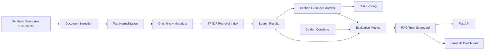

# Enterprise Document Intelligence + RAG Evaluation Lab


## Executive Summary

Large enterprises want GenAI assistants, AI agents, and semantic search over internal documents. A simple "chat with PDF" app is not enough for enterprise use because business users need grounded answers, citations, retrieval metrics, stale-document warnings, sensitive-data controls, and reproducible evaluation evidence.

This project builds a lightweight local RAG evaluation lab that converts synthetic enterprise documents into chunked, indexed, searchable, and measurable knowledge assets.

## Business Problem

Enterprise knowledge is locked inside policies, contracts, claims documents, SOPs, audit files, manuals, and support guidance. AI assistants fail when retrieval is poor, citations are missing, stale documents are used, or answers are not grounded in evidence.

Core question:

> Can this answer be trusted, cited, evaluated, and safely used by a business user or AI agent?

## Architecture



## What Was Built

- Synthetic enterprise document corpus.
- Injected document issue manifest.
- Golden evaluation question set with at least 30 questions.
- Document ingestion and metadata validation.
- Text normalization and deterministic chunking.
- TF-IDF retrieval with metadata-aware reranking.
- Deterministic answer composer with citations.
- Hallucination, stale-document, conflict, and sensitive-data risk warnings.
- Hit@1, Hit@3, Hit@5, MRR, groundedness, citation coverage, and trust scoring.
- FastAPI service layer.
- Streamlit dashboard.
- pytest coverage, Ruff linting, Docker, and GitHub Actions CI.

## Tech Stack

- Python 3.12
- pandas and numpy
- scikit-learn
- DuckDB
- FastAPI and Uvicorn
- Streamlit
- pytest and Ruff
- Docker and GitHub Actions

## Fresh Clone Setup

```bash
git clone https://github.com/mohilamin/enterprise-rag-evaluation-lab.git
cd enterprise-rag-evaluation-lab

python3.12 -m venv .venv
source .venv/bin/activate

python -m pip install --upgrade pip
python -m pip install -r requirements.txt
```

If your default `python` points to Anaconda or Python 3.8, use a clean Python 3.12 environment before running the commands.

## Run Commands

Generate synthetic documents:

```bash
python -m src.data_generation.generate_documents
```

Generate golden questions:

```bash
python -m src.data_generation.generate_golden_questions
```

Run the full pipeline:

```bash
python -m src.pipeline.run_all
```

Run tests and lint:

```bash
python -m pytest
python -m ruff check .
```

Launch the API:

```bash
python -m uvicorn src.api.main:app --reload
```

Launch the dashboard:

```bash
python -m streamlit run src/dashboard/app.py
```

## API Endpoints

- `GET /health`
- `GET /documents`
- `GET /chunks`
- `POST /search`
- `POST /answer`
- `GET /evaluations`
- `GET /scorecards`
- `GET /rag-trust-summary`

## Key Outputs

- `data/raw_documents/documents_metadata.csv`
- `data/raw_documents/injected_document_issue_manifest.json`
- `data/evaluations/golden_questions.json`
- `data/chunks/chunks.csv`
- `data/chunks/chunks.json`
- `data/index/retrieval_index_metadata.json`
- `data/processed/rag_evaluation_lab.duckdb`
- `data/evaluations/retrieval_evaluation.csv`
- `data/evaluations/answer_evaluation.csv`
- `data/scorecards/rag_trust_scorecard.csv`
- `data/scorecards/rag_trust_summary.json`

## Evaluation Metrics

- Hit@1
- Hit@3
- Hit@5
- MRR
- Citation coverage score
- Groundedness score
- Hallucination risk score
- Stale document risk score
- Sensitive data risk score
- Answerability accuracy
- Overall RAG trust score

Formulas are documented in [docs/metrics.md](docs/metrics.md).

## STAR Story

Situation: enterprise teams want GenAI assistants over internal documents, but answers are risky when retrieval is weak, citations are missing, documents are stale, or outputs are not evaluated.

Task: build a document intelligence and RAG evaluation platform that can ingest enterprise-style documents, retrieve grounded evidence, generate cited answers, and measure answer quality.

Action: designed a synthetic document corpus, ingestion pipeline, chunking layer, retrieval index, citation-based answer service, evaluation framework, API, dashboard, tests, and CI/CD workflow.

Result: created a reproducible portfolio project that demonstrates enterprise-ready RAG foundations, including retrieval quality metrics, citation coverage, hallucination-risk scoring, stale-document detection, and audit-friendly evaluation evidence.

## Known Limitations

- Synthetic documents only.
- TF-IDF baseline instead of embedding models.
- Local files and DuckDB instead of a cloud warehouse or vector database.
- Deterministic answer composition instead of a paid LLM.
- No authentication or role-based access in V0.1.

## Future Enhancements

- OpenAI API or local LLM answer generation.
- ChromaDB, LanceDB, pgvector, or Pinecone retrieval backend.
- LangChain or LlamaIndex integration.
- MLflow evaluation tracking.
- Airflow or Dagster orchestration.
- Snowflake or Databricks deployment.
- Authentication, authorization, and audit logging.

## Project Status

V0.1: first working local RAG evaluation lab.
