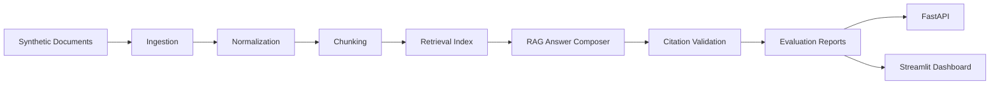

# Enterprise Document Intelligence + RAG Evaluation Lab


## Executive Summary

Enterprise RAG systems fail when they retrieve the wrong policy, cite nothing, use stale documents, expose sensitive content, or answer questions the corpus cannot support. This project builds the evidence layer around RAG: synthetic enterprise documents, golden questions, deterministic retrieval, cited answers, citation validation, evaluation reports, API endpoints, and a Streamlit dashboard.

This is not a generic "chat with PDF" app. The goal is to prove whether an answer can be trusted, cited, evaluated, and safely used by a business user or AI agent.

## First-Screen Proof Points

- Business problem: enterprises need trustworthy GenAI over policies, contracts, SOPs, audit files, support guides, and security playbooks.
- What was built: an end-to-end local RAG evaluation lab with ingestion, normalization, chunking, retrieval, cited answers, validation, reports, API, dashboard, tests, CI, and Docker.
- Evaluation evidence: 40 golden questions, Hit@K/MRR retrieval accuracy, answer quality, citation coverage, hallucination-risk reasons, stale/conflict/sensitive warning checks, and chunk quality reports.
- Current validation: `44 passed` with `pytest`; `ruff check .` passes.
- Tech stack: Python 3.12, pandas, scikit-learn, DuckDB, FastAPI, Streamlit, pytest, Ruff, Docker, GitHub Actions.

## Architecture



## Why Companies Care

Large organizations have thousands of internal documents across policy, legal, claims, security, finance, audit, and support teams. If an AI assistant retrieves stale guidance or invents an answer without citations, the business risk is real. This lab demonstrates how a data engineer or AI platform engineer can make RAG quality measurable before business adoption.

## Key Outputs

- `data/raw_documents/injected_document_issue_manifest.json`
- `data/evaluations/golden_questions.json`
- `data/chunks/chunks.csv`
- `data/scorecards/chunk_quality_summary.json`
- `data/scorecards/retrieval_accuracy_report.json`
- `data/scorecards/answer_quality_report.json`
- `data/scorecards/rag_trust_summary.json`

Sample V0.2/V0.3 evidence:

```json
{
  "total_questions": 40,
  "hit_at_3": 0.9706,
  "mrr": 0.9069,
  "answerability_accuracy": 97.5,
  "citation_coverage_average": 87.5,
  "overall_rag_trust_score": 78.5
}
```

## Quickstart

Mac/Linux with Python 3.12:

```bash
git clone https://github.com/mohilamin/enterprise-rag-evaluation-lab.git
cd enterprise-rag-evaluation-lab

python3.12 -m venv .venv
source .venv/bin/activate

python -m pip install --upgrade pip
python -m pip install -r requirements.txt
```

Conda option:

```bash
conda create -n rag-eval-lab python=3.12 -y
conda activate rag-eval-lab
python -m pip install --upgrade pip
python -m pip install -r requirements.txt
```

Run the lab:

```bash
python -m src.data_generation.generate_documents
python -m src.data_generation.generate_golden_questions
python -m src.pipeline.run_all
python -m pytest
python -m ruff check .
```

Launch the API:

```bash
python -m uvicorn src.api.main:app --reload
```

Launch the dashboard:

```bash
python -m streamlit run src/dashboard/app.py
```

## API Examples

Search:

```bash
curl -X POST http://127.0.0.1:8000/search \
  -H "Content-Type: application/json" \
  -d '{"query": "What controls are required for privileged access?", "top_k": 3}'
```

Answer:

```bash
curl -X POST http://127.0.0.1:8000/answer \
  -H "Content-Type: application/json" \
  -d '{"question": "What controls are required for privileged access?", "top_k": 3}'
```

Key endpoints:

- `GET /health`
- `GET /documents`
- `GET /chunks`
- `POST /search`
- `POST /answer`
- `GET /evaluations`
- `GET /scorecards`
- `GET /rag-trust-summary`

## Dashboard Screenshots

Screenshot capture instructions are in [docs/screenshots](docs/screenshots). Recommended public README screenshots:

- Executive Overview
- Search Lab
- Answer With Citations
- RAG Evaluation Metrics
- Hallucination Risk
- Golden Question Results

## What This Project Proves

- Data engineering: deterministic ingestion, metadata preservation, chunk outputs, DuckDB artifacts, and reproducible scorecards.
- AI engineering: retrieval baseline, cited answer composition, citation validation, answerability checks, and risk scoring.
- MLOps/evaluation: golden questions, Hit@K, MRR, answer quality reports, pass/fail evidence, tests, linting, CI, and Docker.
- Business communication: recruiter summary, technical deep dive, demo script, sample outputs, and public-ready README structure.

## Known Limitations

- Synthetic documents only.
- TF-IDF retrieval baseline instead of embeddings.
- Deterministic answer composer instead of an LLM.
- Local files and DuckDB instead of a production warehouse or vector database.
- Basic Streamlit UI rather than a full product interface.
- No authentication, role-based access, or cloud deployment yet.

## Future Enhancements

- Embeddings with OpenAI or local models.
- ChromaDB, LanceDB, pgvector, or Pinecone retrieval backend.
- LangChain or LlamaIndex orchestration.
- MLflow evaluation tracking.
- Airflow or Dagster orchestration.
- Snowflake or Databricks deployment.
- OpenLineage or Marquez lineage.
- Authentication, authorization, and audit logging.

## Project Status

- V0.1: working baseline.
- V0.2: evaluation hardening with retrieval accuracy, answer quality, citation validation, risk reasons, chunk quality reporting, expanded tests, and improved documentation.
- V0.3: showcase polish with public README framing, demo flow, screenshot guidance, GitHub profile setup, and recruiter/social presentation docs.
