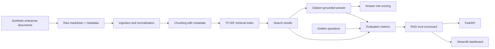

# Data Flow

```mermaid
flowchart LR
    A["Synthetic enterprise documents"] --> B["Raw markdown + metadata"]
    B --> C["Ingestion and normalization"]
    C --> D["Chunking with metadata"]
    D --> E["TF-IDF retrieval index"]
    E --> F["Search results"]
    F --> G["Citation-grounded answer"]
    G --> H["Answer risk scoring"]
    I["Golden questions"] --> J["Evaluation metrics"]
    F --> J
    G --> J
    J --> K["RAG trust scorecard"]
    K --> L["FastAPI"]
    K --> M["Streamlit dashboard"]
```

The system keeps raw documents, chunks, evaluation files, and scorecards on disk so every stage can be inspected.
